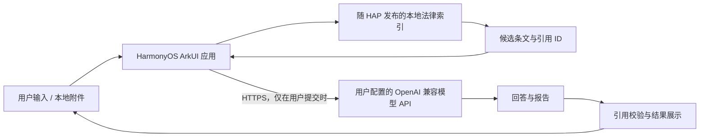

# 劳动权益助手 · LaborLaw AI

<p align="center">
  
</p>

<p align="center">
  <strong>面向普通劳动者的 HarmonyOS 原生劳动法律 AI 助手</strong>
</p>

<p align="center">
  
  
  
  
</p>

这是从原 Python 劳动法 AI 演示项目演进而来的 HarmonyOS 参赛版。应用将本地法律
检索、可核对引用、多轮咨询、案件梳理和材料读取整合到一个原生 ArkUI 应用中。

应用不依赖项目自建后台：使用者在设置页填写自己的 OpenAI 兼容 API，应用直接通过
HTTPS 调用模型服务。本地法律索引随 HAP 发布，检索在设备上完成。

> 本项目仅用于技术研究、普法辅助和应用创新展示，不构成法律意见。内置资料为机械
> 收录，尚未完成全面法律效力审查，实际使用时请核对官方最新文本或咨询专业人士。

## 已实现功能

- **普法咨询**：支持连续多轮问答、高频问题快捷入口和本地法条引用。
- **案件模式**：围绕事实、争议和证据进行多轮梳理，保留完整上下文。
- **智能卷宗**：填写六项案件信息，生成结构化分析报告。
- **材料读取**：通过系统文件选择器读取 TXT、Markdown 和 DOCX；暂不支持 OCR。
- **本地知识检索**：内置 2790 份资料、52903 个文本块，回答展示来源文件和条文。
- **兼容模型 API**：支持标准 OpenAI Chat Completions 兼容接口。
- **安全配置**：API Key 使用 HarmonyOS Asset Store Kit 保存，不写入源码。
- **鸿蒙体验**：沉浸光感悬浮页签、服务卡片、全面屏布局以及手机/平板自适应。

## HarmonyOS 特性

| 能力 | 项目中的用途 |
| --- | --- |
| UI Design Kit `HdsTabs` | 底部悬浮导航、沉浸材质与选中光感 |
| Form Kit | “劳动权益速查”桌面服务卡片及高频场景入口 |
| Asset Store Kit | 本机安全保存 API Key，并禁止跨设备同步 |
| Core File Kit | 由用户主动授权选择 TXT、MD、DOCX 材料 |
| ArkUI 自适应布局 | Phone/Tablet 和宽窗口布局切换 |
| 沉浸式窗口 | 内容延伸至系统栏区域，同时保留安全区 |

详细实现见 [HarmonyOS 特性记录](docs/contest/phase-6-harmony-features.md)。

## 运行架构



没有项目服务器、Python 进程或远程向量数据库参与 App 运行。更完整的模块说明见
[系统架构](docs/architecture.md)。

## 快速开始

### 环境要求

- Apple Silicon 或 Intel Mac
- DevEco Studio 6.1 Release
- HarmonyOS SDK 6.1.0 / API 23
- HarmonyOS 6.1 模拟器或真机

### 打开并运行

```bash
git clone https://github.com/luzimo6-gif/LaborLaw-AI-Agent-AI-.git
cd LaborLaw-AI-Agent-AI-
```

1. 使用 DevEco Studio 打开 `harmony-app/`。
2. 等待工程同步完成。
3. 在 **Project Structure → Signing Configs** 中启用本机自动签名。
4. 选择模拟器或已开启开发者模式的 HarmonyOS 真机。
5. 点击 **Run 'entry'**。

首次运行后进入“设置”，填写 Base URL、模型名称和 API Key，然后测试连接。

命令行构建：

```bash
./tools/harmony/build-debug.sh
```

未配置签名时生成 unsigned HAP；真机安装需要在 DevEco Studio 中配置自己的签名。
完整步骤见 [构建、签名与真机调试](docs/harmonyos-build.md)。

## 模型接口

应用调用：

```text
POST {Base URL}/chat/completions
Authorization: Bearer {API Key}
```

模型服务必须提供 HTTPS 的 OpenAI Chat Completions 兼容接口。Base URL、模型名和
API Key 均由使用者自行配置，仓库不包含任何真实密钥。

## 本地知识库

仓库包含构建后的只读索引：

```text
harmony-app/entry/src/main/resources/rawfile/law_index.json
```

当前版本：

- 源文件：2790
- 可检索文档：2761
- 仅保留元数据：29
- 文本块：52903
- 索引大小：约 52 MiB

这是关键词扩展与加权文本检索，不是向量数据库，也不是 GraphRAG。转换过程不调用
模型，不执行 OCR、去重、历史版本合并或法律效力判断。需要用自己的资料重新生成时，
请阅读 [知识库转换器说明](tools/kb_builder/README.md) 和
[完整构建报告](docs/contest/full-kb-build-report.md)。

## 项目结构

```text
.
├── harmony-app/                  # HarmonyOS 原生应用
│   ├── AppScope/                 # 应用级配置和图标
│   └── entry/src/main/
│       ├── ets/                  # 页面、服务、数据模型和服务卡片
│       └── resources/            # UI 资源与本地法律索引
├── tools/
│   ├── harmony/                  # 命令行构建脚本
│   └── kb_builder/               # 法律资料离线转换器
├── docs/
│   ├── architecture.md           # 系统架构
│   ├── development-process.md    # 三天开发过程与决策
│   ├── harmonyos-build.md        # 构建、签名和真机调试
│   ├── privacy-security.md       # 隐私与安全说明
│   └── contest/                  # 各阶段实施与验收记录
├── backend.py / gui_nice.py      # 原 Python 桌面演示版
└── tests/                        # Python 检索与图谱模块测试
```

## 开发文档

- [文档总览](docs/README.md)
- [系统架构](docs/architecture.md)
- [开发过程与关键决策](docs/development-process.md)
- [构建、签名与真机调试](docs/harmonyos-build.md)
- [隐私与安全](docs/privacy-security.md)
- [贡献指南](CONTRIBUTING.md)
- [资料与许可证说明](NOTICE.md)

## Python 桌面版

仓库根目录保留了原 Python/NiceGUI 桌面演示版及 GraphRAG 实验代码，作为产品演进
和算法对照。HarmonyOS App 运行时不依赖这些 Python 文件。桌面版依赖可通过
`requirements.txt` 安装，相关功能与移动端并不完全一致。

## 开源与责任边界

代码按 [MIT License](LICENSE.txt) 开放。内置法律资料及其来源文件可能受各自权利
声明约束，不因本仓库代码采用 MIT 而自动获得重新许可，详见 [NOTICE](NOTICE.md)。

欢迎提交 Issue 和 Pull Request。涉及法律规则更新时，请同时提供官方来源、发布日期
和效力状态，避免仅凭模型回答修改知识内容。
