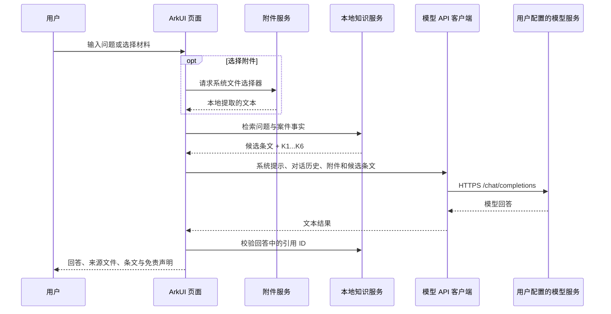

# 系统架构

## 目标

劳动权益助手采用“本地检索 + 用户自备模型 API”的轻量架构。参赛版优先保证：

1. 不需要项目自建服务器。
2. 法律资料和检索逻辑随 App 发布。
3. 模型回答能够回溯到本地候选条文。
4. API Key 只保存在 HarmonyOS 安全存储中。

## 运行时数据流



## HarmonyOS 模块

### 页面层

`entry/src/main/ets/pages/Index.ets`

- 普法咨询和多轮消息。
- 案件对话、六项卷宗和报告生成。
- 附件状态、引用面板与异常提示。
- 设置页与连接测试。
- HdsTabs 悬浮导航、全面屏安全区和宽屏适配。

当前 MVP 将主要界面集中在一个页面文件中，以降低三天开发周期中的导航和状态同步
成本。后续版本可按 `quick/`、`case/`、`dossier/`、`settings/` 拆分组件。

### 服务层

| 文件 | 责任 |
| --- | --- |
| `AiApiClient.ets` | OpenAI 兼容请求、超时、状态码和 JSON 异常处理 |
| `ConfigStore.ets` | Preferences 配置和 Asset Store API Key |
| `KnowledgeService.ets` | 本地索引加载、关键词扩展、排序、引用生成与校验 |
| `AttachmentService.ets` | 系统选件、TXT/MD 读取和 DOCX 正文提取 |
| `LawCardStateService.ets` | 服务卡片状态与更新 |

### 数据模型

`AppModels.ets` 定义页面分区、对话消息、API 配置、附件、法律文档、文本块、引用和
案件字段。发送给模型的 `apiContent` 与界面显示的 `content` 分离，避免在聊天气泡中
直接回显附件全文或系统检索上下文。

### 服务卡片

`LawFormAbility.ets` 和 `lawcard/pages/LawQuickCard.ets` 提供 2×2 桌面卡片。
点击高频场景后通过 Want 参数进入应用，并填充对应咨询主题。

## 本地知识索引

离线转换器将源资料机械转换为紧凑 JSON：

```text
源文件 → 文本提取 → 条文/定长切分 → 元数据归一 → law_index.json
```

运行时不加载 Python、向量模型或数据库。`KnowledgeService` 根据常见劳动争议主题做
关键词扩展，对标题、正文、核心法条和地区匹配加权，返回最多六条候选依据。

该方案的优点是部署简单、无额外服务费用、离线检索可用；限制是语义召回能力弱于
向量检索，且 52 MiB JSON 会增加安装包和启动内存。后续可以升级为分片索引、端侧
数据库或端侧向量检索，但不改变“无项目服务器”的基本方向。

## 网络与信任边界

- 只有测试连接、发送咨询或生成报告时才访问模型 API。
- App 只接受 HTTPS Base URL。
- API Key 通过请求头发送给用户选择的模型服务商。
- 本地检索不联网。
- 附件先在本机提取；当用户提交咨询时，必要文本会随本轮请求发送给模型服务商。
- 模型只能引用本轮提供的 `K1...Kn`，不存在的引用会在显示前移除。

## 当前边界

- 不支持 OCR、图片或扫描 PDF。
- 不做登录、云同步和项目自建后台。
- 不做资料去重、历史版本合并或全面效力审查。
- 不保证模型结论正确，不能替代律师或有权机关。
